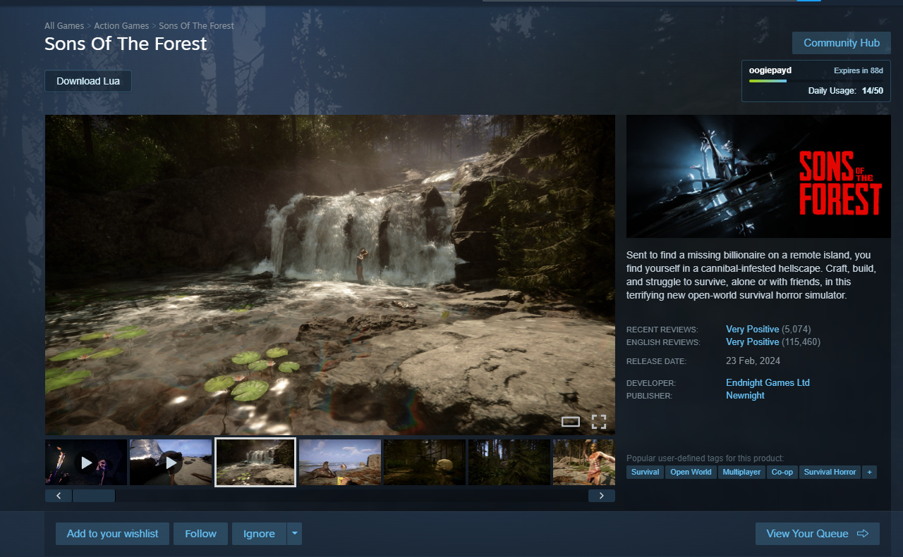
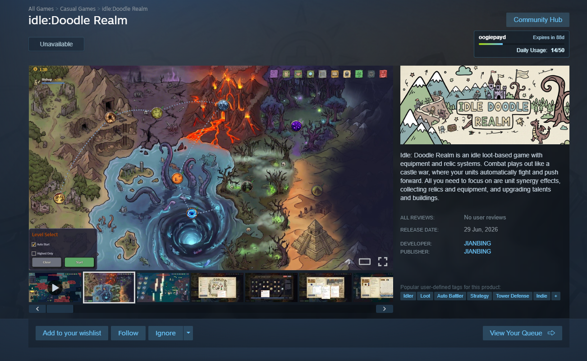
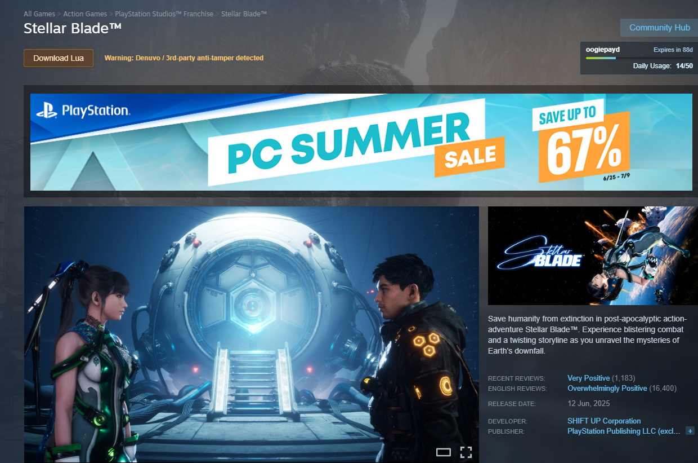
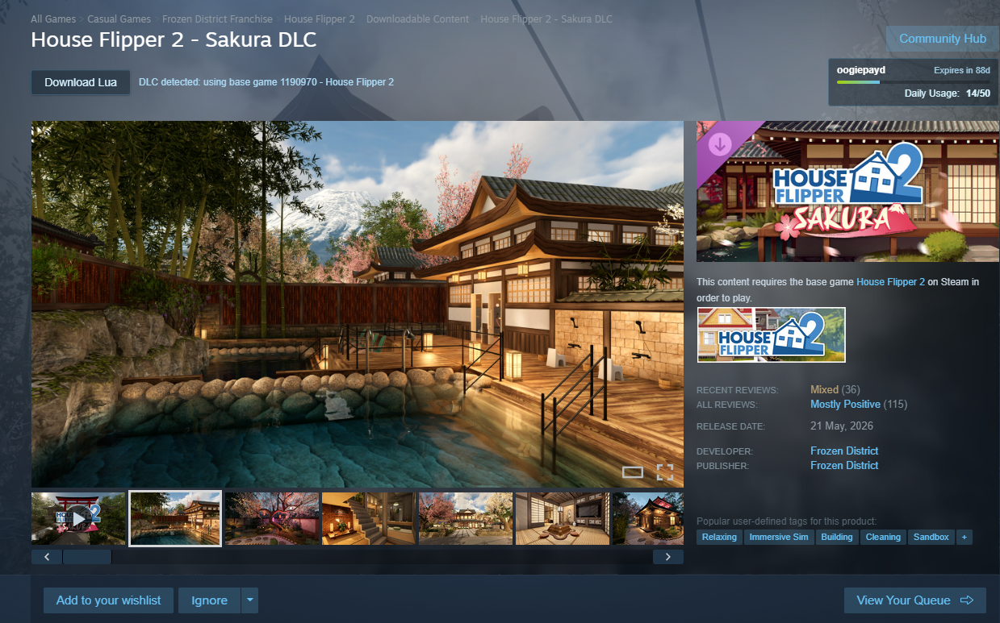
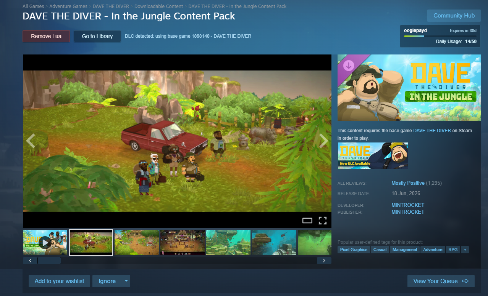
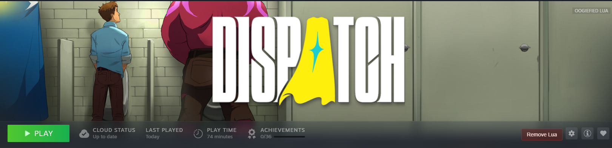

# HubcapLauncher

Official Hubcap helper for running Steam Store and Library Lua controls without Millennium.

## About

HubcapLauncher is meant to be minimalistic, less cluttered, and direct to the point. It starts Steam with DevTools enabled, injects the Hubcap controls into Steam, and uses a native Windows launcher bridge for the file operations that browser JavaScript cannot safely do.

It brings Hubcap functionality to users who want a standalone launcher instead of running Millennium.

## What It Does

- Launches Steam with Chromium DevTools enabled.
- Connects to Steam through Chrome DevTools Protocol on `127.0.0.1:8080`.
- Injects Hubcap Store page controls directly into Steam's Store webview.
- Buttons automatically change depending on whether you already have the Lua installed.
- Automatically detects DLC pages and gets the main game's Lua instead.
- Injects Library remove controls through Steam's shared JS context.
- Reads HubcapTool config from `%Steam%\config\hubcaptools\config.yaml`.
- Uses the configured `HubcapApiKey` only for Hubcap API requests.
- Uses the configured `HubcapLuaDir` for `.lua` checks and installs.
- Downloads the manifest bundle, extracts `.lua` and `.manifest`, copies them to the correct folders, then deletes temporary files.
- Exits automatically when Steam is closed.

## Screenshots

Download only Lua:



Unavailable:



Denuvo Download:



DLC download only:



DLC remove:



Library Remove:



## Build

```powershell
.\publish-win-x64.ps1
```

The published 64-bit single-file exe is:

```text
bin\Release\net9.0-windows10.0.17763.0\win-x64\publish\HubcapLauncher.exe
```

The published exe uses the Windows subsystem, so normal double-click runs do not keep a console window open.

## Run

1. Install and set up HubcapTool.
2. Make sure your HubcapTool config exists at `%Steam%\config\hubcaptools\config.yaml`.
3. Download or build `HubcapLauncher.exe`.
4. Run `HubcapLauncher.exe`.

```powershell
.\bin\Release\net9.0-windows10.0.17763.0\win-x64\publish\HubcapLauncher.exe
```

If Steam is closed, HubcapLauncher starts Steam in dev mode automatically. If Steam is already open but not in dev mode, HubcapLauncher asks to restart Steam in dev mode.

If HubcapLauncher cannot find Steam automatically, move `HubcapLauncher.exe` into the same folder as `steam.exe`, then run it again.

Open a game page in the Steam Store or Library, then use the Hubcap buttons:

- `Download Lua` installs Lua when available.
- `Unavailable` means Hubcap does not have Lua for that app yet.
- `Remove Lua` removes installed Lua.
- DLC pages automatically use the main game's Lua.

## Options

- `--console` attaches to the parent terminal for debugging.
- `--quiet` hides normal console output.
- `--log <path>` writes logs to a specific file.
- `--no-steam-launch` connects to an already-running dev-mode Steam.
- `--restart-steam` closes Steam and launches it with dev-mode flags.
- `--allow-multiple` disables the single-instance guard.
- `--list-targets` prints reachable Steam DevTools targets.
- `--probe-targets` inspects reachable Steam DevTools targets.
- `--check-ui` checks whether Store/Library UI was injected.

## Notes

HubcapLauncher depends on Steam DevTools/CDP being reachable, so Steam has to be started with dev-mode flags by this launcher or another equivalent command.
